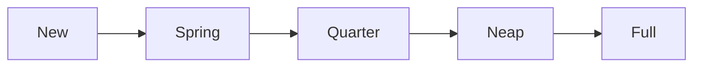

# The booklet format, v0.10

**A booklet is one Markdown file that a person can read and edit in any text editor, that Obsidian shows as a normal note, and that the Booklet renderer, or a Booklet plugin inside Obsidian, turns into activities with questions, widgets and reading.** The prose is the document. Booklet's own elements are single callout lines. Anything that is data, and anything a reader answers, lives in fenced blocks at the end of the file. A new booklet that nobody has answered yet contains no JSON at all.

> **Status: v0.10, draft.** This is a young, evolving format — v0.10 is the one
> version number that matters: this spec, the renderer, the skill, the
> tests, and the `booklet: "0.10"` every file's front matter declares, all
> together, all the same number. Nothing here is frozen: the format itself
> may still change, a file names the one version it is written in, and a
> reader opens only that version, so it doesn't promise stability yet. There is no earlier
> format to compare against or convert from — it was retired entirely on
> 2026-09-29, and this spec no longer documents or mentions it.
>
> **This document may describe things the reference renderer does not do yet.** The spec is allowed to have
> options the renderer can't do yet. Each one is marked where it is described, in the words "The reference
> renderer does not do this yet", and all of them are listed in section 13.

**Why it looks like this, in short.** A booklet's design used to live as fenced JSON beside its prose — readable, but not really hand-*editable*: nobody sits down and retypes a JSON object correctly by hand. v0.3 rebuilds the design itself as Markdown, using constructs that already exist and already render somewhere real — GitHub's task lists and callouts, Obsidian's callouts and block embeds, CommonMark's footnotes — rather than inventing new syntax to parse. What Booklet needs and no existing convention supplies (a question's kind, a module's boundary) is one small vocabulary of callout lines, `> [!kind|id] Title`, so there is exactly one new grammar to learn, not several. The full account of what was surveyed and why each choice was made is [`docs/why-markdown.md`](docs/why-markdown.md).

---

**Contents**
1. [What a booklet is made of](#1-what-a-booklet-is-made-of)
2. [The file: name and front matter](#2-the-file-name-and-front-matter)
3. [Structure: activities and pages, with every heading left free](#3-structure-activities-and-pages-with-every-heading-left-free)
4. [Booklet lines: one grammar for everything](#4-booklet-lines-one-grammar-for-everything)
5. [Questions](#5-questions)
6. [Reading: callouts, hints, citations, images and figures](#6-reading-callouts-hints-citations-images-and-figures)
7. [Widgets and other data](#7-widgets-and-other-data)
8. [Records: what a reader answered](#8-records-what-a-reader-answered)
9. [Languages](#9-languages)
10. [Obsidian and GitHub: what to expect](#10-obsidian-and-github-what-to-expect)
11. [A complete booklet](#11-a-complete-booklet)
12. [Conformance](#12-conformance)
13. [What's not built yet](#13-whats-not-built-yet)

---

## 1. What a booklet is made of

Four things, and nothing else:

- **Front matter**: a few flat keys at the top, the way Obsidian, Hugo and Jekyll write them.
- **Prose**: ordinary Markdown. Headings at every level, paragraphs, lists, emphasis, links, tables, footnotes, `$math$`, and fenced code, all free for writing.
- **Booklet lines**: a callout line, `> [!kind|id] Title`, marks anything Booklet needs to know about: an activity, a question, a widget, a menu.
- **Fences**: data and records in fenced code blocks, by convention at the end of the file. No code in the prose; data below, referenced from above.

The rule that decides every detail below: **a booklet is answerable only in Booklet's renderer or a Booklet plugin, so everywhere else it only has to read well.** Simple and clean to write; breaks nothing in Obsidian; breaks nothing too badly on GitHub.

---

## 2. The file: name and front matter

**Name.** `<slug>.booklet.md`, and for a translation `<slug>.<lang>.booklet.md`, for example `tides.booklet.md` and `tides.es.booklet.md`. Obsidian shows the note as `tides.booklet`, which is fine. A reader decides what a file is from its contents, never its name.

**Front matter.** Flat keys only, because Obsidian's Properties editor treats nested values as second-class and may rewrite the block when a property is edited. A renderer must accept any key order and any quoting.

```yaml
---
booklet: "0.10"
id: example/tides
title: How tides work
lang: en
version: "0.1"
copyright: Example Press, 2026
license: CC-BY-4.0
---
```

- `booklet` is the file format generation this file uses (see the status note above). `id` names this booklet across its translations and versions. `lang` is the one language this file is written in (section 9).
- **The front matter's `id` is the booklet's own name, not an id in the sense of section 4.** It may hold slashes (`example/tides`), and it is not one of the ids a question, an activity or a module carries, so the rule for those (letters, digits and dashes, unique in the file) does not apply to it.
- `title` is the booklet's own name: the one name its home screen, its row in a list of booklets and the name of the file a renderer saves all show. A module file's own `title` names the module and never the booklet, so adding a module leaves the booklet's name alone. A renderer may let a reader rename the booklet, which rewrites this one line, with the new name as a quoted string.
- **Write the marker in quotes: `booklet: "0.10"`.** Unquoted, a YAML reader (Obsidian's properties panel, GitHub) takes `0.10` for the number 0.1 and may write it back that way. A renderer reads the marker as text and compares versions as two whole numbers, major and minor, so 0.10 is later than 0.9; `booklet: 0.10`, `"0.10"` and `'0.10'` are all this format, and `booklet: 0.1` is the old format 0.1. The linter warns on the unquoted form, and a renderer writes the quoted one.
- `copyright`, `license`, `source` and `version` live in front matter — the file is the unit that travels (section 3), so the front matter travels with it. In a file that holds one module and no notice callout, they are that module's notice (section 3).
- Reserved by Obsidian and therefore never used for anything else: `tags`, `aliases`, `cssclasses`.

---

## 3. Structure: activities and pages, with every heading left free

**Headings never carry structure.** Every heading level is free for prose. Structure comes from lines Booklet adds, never from heading depth.

**A booklet is a collection of modules, and it is natively one file.** A module is the unit that travels whole, and the unit inside which activities may refer to each other: a weekly report that reads the week's entries, or a dashboard that draws itself, only works if the activities it reads are guaranteed to arrive together, and the module is that guarantee. A renderer handed a folder assembles one file from it (below).

**A module is fenced: an opening line and a closing line, both required.**

```markdown
> [!module|week-1] Week 1

> [!activity|w1-words] Words

…

> [!module|week-1 end] End of Week 1
```

- A linter and a renderer refuse a file whose module is opened and not closed, closed and not opened, or whose fences overlap. Modules bleeding into each other is the failure this rule prevents.
- Within a module, an activity may read another's answers and entries by id. Across modules it may not, and a renderer refuses a reference that crosses.
- **Bare activities and modules may share a file.** A bare activity sits outside any module fence, by convention before the first one, and refers to nothing else. A file with no module fence is bare activities only: a worksheet needs no more.
- A module id is used once in a file, and stays unique across a person's collection; adding a module whose id is already present replaces it. Any other id a module uses is its own (section 4).

**Where data goes: inline, at the end, or in another file.** The blocks a module's activities refer to (widgets, figures, menus, image definitions) may sit inside the module's own fence, in a data section at the end of the file, or in another file that the manifest names. A data section is opened by a `> [!data] Data` line, which is shared, or by a `> [!data|week-1] Data for Week 1` line, which belongs to the module whose id it carries, the way a records section does. A block inside a module's fence is that module's, and no other module can use it. **A block under a `> [!data|week-1]` line is that module's too, as if it sat inside the fence**, until the next `data`, `records`, `module` or `activity` line; a block under a plain `> [!data]` line is shared. A reference is looked up in the module's own fence, then the module's own data section, then the shared data section, then the files the manifest names (the manifest is not read yet; section 13), and never in another module's fence or data section (section 4). A file may have several data sections. A data line takes an optional module id and no settings. A tool that adds a module to a booklet puts the data it brings under the module's own `> [!data|module-id]` line, and an update of the module replaces exactly its fence and that section. A file that holds one module may keep all its data under a plain `> [!data]` line; those blocks are that module's when the module is added to a booklet, and inside the file they are found either way.

### A module's notice

A module may state its terms where they travel with it, in a `notice` callout, the first thing inside its fence:

```markdown
> [!module|mensio-check-in] A mindful check-in

> [!notice]
> license: Free to copy and share, unmodified and with this notice intact.
> copyright: Mensio Mental Health, 2026
> source: https://example.org/check-in
> version: 1.2

> [!activity|check-in repeat] Mindful check-in
```

- Each line is `key: value`, and the keys are `license`, `copyright`, `source` and `version`; any may be left out, and anything else in it is a linter error. A notice takes no id and no settings, a module has at most one, and it sits inside the module's fence before the module's first activity. A notice outside a module's fence, or after its first activity, is an error in the linter and is ignored by a renderer, which reports it. A notice's `version` is the module's, and need not look like the booklet's.
- **A file that holds one module and no notice callout is still covered:** its front matter's `license`, `copyright`, `source` and `version` are that module's notice, so nobody has to rewrite a module file; either form may be used, and when both are present the callout wins.
- A tool that adds a module whose notice is only in its file's front matter writes it into the module's fence as a `> [!notice]` callout, so the notice is in the booklet's own file, and an update replaces it with the module's. A renderer keeps the callout exactly as written.
- A renderer shows a module's notice as a quiet disclosure, closed until opened, headed "About this module": the licence, the copyright, the source (a link only when it is an `http://` or `https://` address, otherwise plain text) and the version, on the module's own page and at the foot of a module that is one activity. A module with no notice shows nothing. Every value is text.

**Answers never travel inside a module.** A module used for months would drag hundreds of lines of JSON with it. Records sit in the records section at the end, opened by `> [!records] App record`, and grouped by module under `> [!records|week-1] Week 1`, so the right JSON is one search away. **The module id on a records line is what ties the record blocks under it to that module**, until the next records line: its `answers` are that module's, and the activity named on an `entries` or `draft` block is that module's activity. Record blocks under the plain `> [!records]` line, with no module line before them, belong to the bare activities. To take a module and its answers somewhere else, copy two sections.

**One manifest says where everything is.** Right after the front matter, a `manifest` callout lists the booklet's parts in order, each `inline` or a link to the file that holds it:

```markdown
> [!manifest] How tides work
> - module week-1: inline
> - module week-2: [[week-2.booklet]]
> - data body-map: [[shared/widgets.booklet#^body-map]]
> - data: inline
> - records: inline
```

It is required when anything lives in another file, and recommended always, as the table of contents an editor sees first. A linter checks it against the file and reports a part it names that is missing, or a part in the file it doesn't name. (The reference renderer does not do this yet; see section 13.) The reference renderer reads one file and skips the manifest, parts that live in another file (`[[week-2.booklet]]`, a data block in another file) are not read, and the reference linter does not check the manifest. It all works as one file; the referenced-out form is described here and not yet done. A whole-note embed, `![[week-2.booklet]]`, may stand in a manifest line where the module should render inline in Obsidian.

**Paths follow Obsidian's conventions.** `[[week-2.booklet]]` (Obsidian resolves a note by name anywhere in the vault) or an ordinary Markdown link, `[Week 2](modules/week-2.booklet.md)`, relative to the booklet's own folder. A block in another file is `![[week-2.booklet#^body-map]]`. Absolute machine paths such as `~/notes/…` are outside what Obsidian (vault-relative) or a browser (no file system) can read, so they are not supported; an unresolved link is shown as one and breaks nothing.

**Navigating the file in an editor.** Every part opens with a line of one shape, so searching for `[!module|`, `[!activity|`, `[!data` or `[!records` walks the file, and the manifest at the top is its table of contents.

**An activity starts at an activity line and runs to the next one.** A file with no activity line is one activity, named by the front matter title. So a one-page worksheet needs no structure at all.

```markdown
> [!activity|rd-tides] Why the sea rises twice a day

Prose, headings, questions…

> [!activity|rd-check repeat] Check yourself

…
```

The words after the id are the activity's **settings**:

| setting | what it means |
| --- | --- |
| *(none)* | answered once, edited in place |
| `repeat` | each completion is kept as a dated entry, with a history |
| `repeat daily` | one kept entry per day; completing again replaces today's |

`hidden` may follow either (kept in the file, not offered). `daily` is only ever written after `repeat`.

**Pages are separated by a horizontal rule.** Any thematic break inside an activity (`---`, `***`, `___`) is a page break, the way Marp splits slides. A page's name in the left menu is its first heading, at whatever level; a page with no heading is "Page 2". An activity with no rule is one page.

⚠️ `---` needs a blank line above it, or Markdown turns the line before it into a heading and the page break vanishes. `***` has no such trap. Both are accepted.

**Links between activities** are ordinary heading links, which Obsidian resolves natively: `[[#Check yourself]]` or `[Check yourself](#check-yourself)`. The renderer opens the activity that contains that heading, **looked for in the link's own module** (the bare activities together are one module), never in another module's fence; a link whose heading only another module has is shown as plain text, like a link to a heading that is nowhere, and the linter warns. Reading another activity's *answers* is a module matter, above.

### Rows: things side by side

A row asks for what is inside it to be laid side by side when there is room.

```markdown
> [!row]

### Overdue

```booklet query
from: overdue
```

### Due soon

```booklet query
from: due-soon
```

> [!row end]
```

- A row opens with `> [!row]` and closes with `> [!row end]`, like a module's fence.
- **Each heading at the shallowest level inside the row starts a cell.** Anything before the first heading is a cell of its own. With no headings at all, each block is a cell.
- A renderer decides how many cells fit across, and puts them one under another, in file order, on a narrow screen. A file never states widths, columns or breakpoints.
- Anything may go in a cell: prose, questions, widgets, queries, figures.
- Rows do not nest, and a row does not cross a page break, an activity line or a module fence.
- In an editor, on GitHub and in Obsidian a row reads top to bottom, with its two marker lines showing as small callouts.

---

## 4. Booklet lines: one grammar for everything

```markdown
> [!kind|id setting:value flag] Title
```

- **`kind`** says what the line is: an activity, a question kind, a widget, a menu, a row, or a reading callout. Kinds are Booklet's own vocabulary, and the set is meant to grow (section 5).
- **`id`** is required for anything that stores an answer or is referenced (activities, questions, widgets, menus). Letters, digits and dashes only, so every id is also valid wherever Obsidian wants one. Unique within its module (below). Reading callouts need none, and neither does a row (`> [!row]` … `> [!row end]`, section 3), which is structure like a page break.
- **Settings** follow the id, separated by spaces: `menu:feelings`, `min:0`, `open`, `repeat`.
- **The title** is the words a reader sees: the question, the activity name, the caption.
- **A fold marker** may follow the bracket, as in Obsidian: `> [!hint]- Hint` starts folded.

**An id belongs to its module.** An id is unique within its module: activity ids, question ids, widget-line ids, menu ids, block ids (`^id`) and footnote ids. Two modules in one file may use the same id for different things, and neither can see the other's. Module ids are unique within the file. Activities outside any module fence (bare activities) together count as one module with no name. A module's scope is its fence and its data section (`> [!data|module-id]`, section 3): an id under that line is in the module's scope, as if it sat inside the fence. The plain data section at the end of the file (`> [!data] Data`) is shared: a block there (a widget, a figure, a data block, a menu) may be used by any module, and its ids are unique among the blocks in that section. **A reference is looked up in its own module first (its fence, then its data section), then in the shared data section, and never in another module's fence or data section.** That holds for an embed `![[#^id]]`, a `menu:id`, a query's `from:` and a footnote mark `[^id]`. What a reader answered is tied to its module by the module id on a records line (section 8), so the same question id in two modules holds two answers. A file whose ids were unique across the whole file, as v0.8 required, still has unique ids under this rule.

**What comes after the line.**
- A **list** belongs to the line (a question's options, a menu's entries). It may follow directly or after one blank line; two blank lines end the question. **One exception, from Markdown itself:** only a numbered list that starts at `1.` may interrupt a paragraph, so a list starting at `0.` (or any other number) directly under the line is swallowed into the title. Put the blank line in; the reference linter requires it there and allows it everywhere else.
- **Lines starting with `>`** directly under a booklet line belong to it. Under a reading callout they are its prose. Under a **question** line they are its **help text**: a renderer shows them under the prompt. A question's prompt is its title. A `> [!hint]-` callout after a question is a different thing: a hint the reader opens (section 6).
- **A paragraph** after the line needs a blank line first, like any paragraph. Without one, Markdown folds it into the callout (a "lazy continuation").
- A **hint** or **solution** callout right after a question belongs to that question (section 6).

**What each kind takes.** Settings are the flags and the `key:value` words after the id. Each kind takes only the settings in this table, because a mistyped setting (`mx:5` for `max:5`) would otherwise vanish without a word. A setting a kind does not take is an error in the linter, and a renderer ignores it and reports it. `daily` is only ever written after `repeat`, and the values of `min:`, `max:` and `step:` are numbers.

| kind | settings it takes |
| --- | --- |
| `module` | `end` |
| `activity` | `repeat`, `repeat daily`, `hidden` |
| `row` | `end` |
| `text` | `long` |
| `lines`, `scale`, `matrix`, `date`, `menu`, `hint`, `solution`, `data`, `records`, `manifest`, `notice` | none |
| `choice`, `multi` | `open`, `menu:<id>` |
| `number` | `min:`, `max:`, `step:` (numbers) |
| `widget` | `readonly`, `describe` |

**Unknown kinds.** A line with an id or settings whose kind is not in this table is an **unknown kind**. A renderer draws it as a callout, with a quiet line under its title saying that it does not know the kind, and reports it; the linter warns. A line with no id and no settings is a reading callout of whatever kind its author chose (`note`, `tip`, Booklet's `diff`, and so on, section 6), drawn with no notice.

**Case.** Kinds, settings, query keys and `as:` are read without regard to case. Ids and values (theme values, tone names, and the words a person wrote) are exactly as written.

In Obsidian, an unknown kind renders as a note-style callout with the title, so every Booklet line is a visible, titled box there. The `|id` part is callout metadata, which Obsidian parses into `data-callout-metadata` for themes to style; it is not documented in Obsidian's own help, but it renders correctly.

---

## 5. Questions

**Principle: declare the kind on the question line; put plain lists under it. Nothing else.**

### Text and lines

```markdown
> [!text|noticed] What surprised you?

> [!text|reflection long] Write freely about the week.

> [!lines|wins] Three things that went well
```

`text` is a text answer; `long` asks for a bigger box. `lines` is repeated one-line entries.

### Choice: pick one, pick any

```markdown
> [!choice|biggest] When do the largest tides come?
- [ ] At the quarter moons
- [x] Near the new and the full moon

> [!multi|felt open] What did you feel? Add your own.
- [ ] Calm
- [ ] Tired
- [ ] Curious
```

- `choice` takes one answer, `multi` any number. `open` lets the reader add options of their own.
- **The reader's own option.** With `open`, a field and an Add button sit under the options. An option the reader adds is stored in the answer as the words they wrote, a string, in the place a position would be: a `choice` holds the position or the string, a `multi` a list of positions and strings. Text equal to a listed option (ignoring case and spaces) presses that option instead; an own option is never added twice, and nothing is ever written into the file's list of options. A renderer should offer again, in an activity that keeps entries, the own options the reader added to that question in earlier kept entries, as ordinary unpressed options after the listed ones. A shared menu (`menu:id`) with `open` behaves the same.
- **`[x]` marks a correct option**, for study booklets. A worksheet with no right answer leaves every box `[ ]`. A renderer shows the reader whether they were right once they have answered: for a `choice`, as soon as they pick, the picked option is marked right or not, and the correct one is marked as the answer; for a `multi`, a Check button marks each option picked and right, picked and not right, or right and missed. Nothing is scored and nothing is stored: the answer is recorded as usual and the file never says whether it was right. An own option (`open`) is neither right nor wrong. A `choice` with more than one `[x]` has the first as its answer. **The correct option is visible to anyone who opens the file as text.** In Obsidian's Reading view, a click on a checkbox rewrites `[ ]` to `[x]` in the file — a real behavior, and the accepted trade-off: a booklet's own reader answers it in Booklet, never by clicking a checkbox in an Obsidian note, so the answer key is never at risk from ordinary use.
- **Options are identified by position, not by id.** The third option is the third option in every language file too, so a whole questionnaire carries one id. This is what removes per-item tags. A file that reorders options after people have answered breaks its own answers.

### Scale, number, date

```markdown
> [!scale|mood] How was today?

0. Awful
1. Rough
2. Fine
3. Good
4. Great

> [!number|sleep min:0 max:24] Hours slept

> [!date|when] When did it happen?
```

A `scale` lists its anchors as a numbered list; **the number is the stored answer**, so a questionnaire scored from 0 starts at `0.`, with a blank line above it (section 4).

### Matrix: items and anchors

A matrix question is several items answered on one shared scale of anchors, such as a symptom questionnaire. It is written as a bulleted list of items, then a numbered list of anchors, deliberately not a table, so one stray space never breaks it:

```markdown
> [!matrix|phq] Over the last two weeks, how often have you been bothered by…

- Little interest or pleasure in doing things
- Feeling down, depressed, or hopeless

0. Not at all
1. Several days
2. More than half the days
3. Nearly every day
```

A blank line may separate the two lists (section 4), and the numbered list needs one above it when it starts at `0.`. The reader chooses one anchor per item. **The answer is stored as a list with one anchor number per item, by position** (`[1, 3]`; `null` for an item not yet answered), under the question's id. Like a `scale`'s, the number is the stored answer, so the anchors' own numbers are what is kept.

### Shared menus

A list used by several questions is written once, in the module whose questions use it (or in the data section, for every module to use), and named on the question line:

```markdown
> [!menu|feelings]
- Calm
- Tired
- Curious

> [!multi|morning menu:feelings] This morning I felt…

> [!multi|evening menu:feelings] This evening I feel…
```

### Widgets as questions

A widget the reader operates (the body map, the feelings grid) is a `widget` line whose body embeds the widget's data block (section 7). What the engine records is stored under the widget's id.

### The kinds, in one table

| kind | answer stored | under the line |
| --- | --- | --- |
| `text` | a string | nothing (`long` for a big box) |
| `lines` | a list of strings | nothing |
| `choice` | the option's position, from 1; with `open`, or the reader's own string | a task list; `[x]` = correct |
| `multi` | a list of positions, plus the reader's own strings with `open` | a task list; `[x]` = correct |
| `scale` | the anchor's number | a numbered list |
| `number` | a number | nothing; `min:` `max:` `step:` |
| `date` | `YYYY-MM-DD` | nothing |
| `matrix` | one anchor number per item, by position | a bulleted list, then a numbered list |
| `widget` | whatever its engine records | an embed of the data block |

**How the vocabulary grows.** A new question kind is a new kind word, a documented shape for what follows the line, and an engine in the renderer. The grammar never changes. A renderer that meets a kind it doesn't know shows the line as a callout and what follows as lists, and says so, instead of failing (section 4, "Unknown kinds").

---

## 6. Reading: callouts, hints, citations, images and figures

### Callouts

Reading set apart is an Obsidian callout, with `>` on every line of its body. Use Obsidian's built-in kinds where they fit (`note`, `tip`, `example`, `quote`, `question`, `warning`), and Booklet's three for guided reading: `diff` (where this differs from the reader's own guide), `law` (the rule as it now stands), `opinion` (an author's view, not to be learned as a rule).

```markdown
> [!diff] Your guide says the tide turns every six hours
> The guide rounds it off. High water comes a little later each day.[^atlas-12]

> [!group]- Background, if you want it
> Folded until opened. Anything Markdown can hold goes inside.
```

### Hints and solutions

A `hint` or `solution` callout directly after a question belongs to it. Fold them.

```markdown
> [!choice|biggest] When do the largest tides come?
- [ ] At the quarter moons
- [x] Near the new and the full moon

> [!hint]- Hint
> Think about when the sun and the moon pull in the same direction.
```

### Citations

A citation is an ordinary CommonMark footnote — the mark `[^id]` in the text, and its definition, `[^id]: …`, anywhere in the file. There is no separate sources registry: a source cited at two places is two footnotes.

```markdown
Most harbours see two high tides each lunar day.[^atlas-12]

[^atlas-12]: *The Harbour Tide Atlas*, 2nd edition (2019), p. 12: "The tide rises and falls twice in each lunar day." Verified 2026-09-20.
```

**A footnote's note, read into a citation.** The reference renderer reads a definition's text and, where it fits the pattern `*Title*, details, p. N: "quote" Verified YYYY-MM-DD.`, turns it into a source and a citation — title, edition, page, quote, and verified badge. This gives a reading module a numbered mark, side panel, hover preview and verified badge, with no separate registry to maintain. A note that doesn't fit the pattern becomes the quote alone, with no source; the panel shows this gracefully (a plain "no source" line) rather than failing. The pattern, piece by piece:

| piece | example | required? |
| --- | --- | --- |
| the source's title | `*The Harbour Tide Atlas*` (italic) | for a source to be shown at all |
| its edition or other detail | `2nd edition (2019)` | optional |
| the page or place | `p. 12`, `pp. 12–14`, `art. 14` | optional |
| the quote, in quotation marks | `"The tide rises and falls twice…"` | required for any citation |
| a verified date | `Verified 2026-09-20.` | optional; shows the ✓ badge |

**The definition line itself never shows.** It is stripped from the document's own prose at the point the file is read, so it is never rendered as a stray paragraph — the citation lives only in the numbered mark and its panel.

### Images

Reference style, with the address at the end of the file among the data, so the prose stays clean. GitHub and Obsidian both resolve it and hide the definition line.

```markdown
![The harbour at low water][harbour]

[harbour]: images/harbour.jpg
```

Images are linked, never embedded.

### Figures: diagrams placed by reference

A diagram is written once, in the data section, with an Obsidian block id on the line after its fence, and placed in the prose with Obsidian's own embed:

```markdown
Here is the cycle:

![[#^tide-cycle]]

…


^tide-cycle
```

Obsidian draws the diagram natively at the embed. On GitHub the embed line shows as text and the diagram still renders where the fence itself sits. A mermaid fence written directly in the prose still works everywhere, as it always did.


### Queries: showing kept entries and data

A `booklet query` block, placed in an activity's prose, shows what the reader has kept elsewhere in the same module, or the rows of a data block (section 7). It is read-only and takes no answer.

```booklet query
from: log
fields: situation, ease
limit: 3
empty: Nothing logged yet.
```

- `from:` (required) is an activity id or a question id in the same module. An activity must keep entries (`repeat` or `repeat daily`); the query shows its kept entries, newest first, each with its date and answers. A question shows that question's answers: each kept answer with its date if its activity keeps entries, or its one answer if not.
- `fields:` (optional, with an activity) names the questions to show, comma-separated, in that order. Without it, every question is shown.
- `limit:` (optional) shows only that many of the most recent entries.
- `empty:` (optional) is what shows while nothing is kept. Without it, the renderer shows its own short line.
- It reads kept entries and given answers only, never a draft in progress.
- A query never reads across modules. One whose `from:` names nothing, or something in another module, is refused: the linter reports an error and a renderer draws nothing for it. The activities outside any module fence are one module for this rule.
- The kind, `query`, is on the fence line; the settings are the block's lines, `key: value`. Ids follow the rule in section 4 (letters, digits and dashes).
- In Obsidian without a Booklet plugin, and on GitHub, the block shows as a short code block.

A query can also draw a data block, and can say how.

```booklet query
from: short-list
as: list
group: why
```

- `from:` may name a data block (section 7) in the same module or in the file's data section.
- `as:` chooses the view. `cards` is the default for kept entries; `table` is the default for a data block.

**Roles.** A view draws a row from the parts its fields play. There are five, and each is read from the field of the same name unless the query names another.

| role | what it is | read from |
| --- | --- | --- |
| `label` | the row's name | the field `label`, or else the first field |
| `value` | its main figure | the field `value` |
| `note` | a quieter second line | the field `note` |
| `badge` | a short word, drawn as a pill | the field `badge` |
| `tone` | `good`, `warn` or `bad` | the field `tone` |

So rows whose fields are already called `label`, `value` and so on need only `from:` and `as:`. A line such as `label: bucket` points a role at a field with another name. A role no row carries is simply not drawn.

**Tone.** A view's `tone` is `good`, `warn` or `bad`, exactly as written. A theme's `good`, `warn` and `bad` keys (section 7) set those same three colours, and they are the colours a widget calls `green`, `amber` and `warm` (section 7). A widget may also use `slate` and `teal`, which have no tone.

| `as:` | draws | reads |
| --- | --- | --- |
| `cards` | one dated card per kept entry | `fields`, `limit` |
| `table` | one row per row, one column per field | `fields`, `group`, `limit`, `badge`, `tone` |
| `list` | one line per row: badge, label, the other fields, value; the note beneath | `label`, `value`, `note`, `badge`, `tone`, `fields`, `group`, `limit`, `parent` |
| `tiles` | one tile per row: a big value over a label | `label`, `value`, `note`, `tone`, `group`, `limit` |
| `bars` | one bar per row: a label and a length | `label`, `value`, `tone`, `limit` |
| `line` | one line per field, across the rows in order | `label`, `value`, `fields`, `limit` |

- `fields:` **picks** among the fields the rows have, and names the **other fields to show**, in order: a table's columns, a list row's quieter extras, a line chart's lines, a card's questions. (A data block's own `fields`, section 7, **declares** them: each key, its label and their order.) Without `fields:` a table shows every field, a list shows every field that plays no role, and a line draws the `value`.
- A table shows the fields its data block declares, or else the keys of the first row. A list's extras, without `fields:`, never include the `id` field, the `group` field or the `parent` field.
- `label:` falls back to the first field only when the query gives no `label:` at all. A `label:` that names a field no row carries draws no label (the linter warns).
- `group:` names a field; rows that share its value are drawn together under that value, in the order the values first appear, with a count.
- `limit:` is a positive whole number (anything else is ignored and reported). It draws only the first rows, that many, and it is applied before grouping and before anything the reader filters. For kept entries those are the newest.
- `from:` naming a single question makes that question the value.
- With `fields:` on kept entries, an entry that answers none of the named questions is not shown.
- `parent:` names the field that holds the `id` of the row this row sits under. A list whose rows carry it is drawn nested: each row under its parent, opened and closed by the reader. The default field is `parent`, so rows with `id` and `parent` fields nest with no key at all. A row whose parent is not among the rows is drawn at the top. A row that is its own ancestor (a cycle) is drawn once, at the top. When two rows share an `id`, the first is used. `limit` counts top-level rows; `group` is not drawn on a nested list.
- A `tone` of `good`, `warn` or `bad` colours the row's badge, or its value when it has no badge; a tile; a bar. Anything else is plain. A table's `tone` colours its badge column; a table with no badge column ignores `tone`. Tone is always also said in words to a screen reader.
- A `badge` that is a list is drawn as several pills.
- **Tiles with no value are pills.** When no row has a value, there is no big figure to draw, and each tile is a short pill holding its label: a strip of them reads as a status line.
- Every view also works on kept entries (`from:` an activity): each kept entry is a row, its questions are the fields, and its date is the field `date`.
- Values are plain text: nothing in a data block is read as Markdown or HTML.
- A query that sets a key its view does not read is not an error; the linter says so.

```booklet query
from: by-bucket
as: bars
label: bucket
value: count
```

```booklet query
from: sleep-log
as: line
fields: hours
```

- **Bars.** Each row is one bar: its label names it and its value is its length. Bars are drawn across the page, one under another, in row order, and always start at zero.
- **Line.** The rows, in order, are the points from left to right, and the label is written along the bottom. `fields:` names one or more number fields, each drawn as its own line and named by its field label; without it the value is drawn.
- A value that is not a number draws nothing: no bar, and a gap in a line.
- A chart always offers the same numbers as a table, so nothing is shown only as a picture.
- On kept entries a `number` or `scale` question is a number field, and the label is the entry's date. A reader's own answers over time are a line.
- A renderer chooses the scale, the ticks and the size, and fits the chart to the space it has, including inside a row.

**Sorting and filtering are the reader's.** A renderer may let the reader sort and filter the rows of any view on screen, and should offer the same control on every view. A renderer may offer it only on longer views, and a line chart keeps its order. It is saved nowhere, and a file never states it: a page always opens in the order its rows were written.

A query that names a data block in another module, or `as: cards` on a data block, or an `as:` that is not one of the six views, is refused like any other query that cannot be drawn. A query key this section does not list is ignored, and a renderer reports it; the linter reports an error. A page that draws a data block is not a reading-only page: it stays open, not folded into sections.

**Design rules for views.** These bind anyone extending the format.

1. A view is a way to draw rows. It reads the shared roles and takes no key of its own.
2. A new role must mean the same thing in every view that draws it, and two real pages must need it.
3. A look that styling, density, or the shaping of rows by whatever wrote the file can give is never a new view or key.
4. A reader may open, close, sort and filter what is on screen, and none of it is saved. Anything that changes the file or sends something elsewhere is not a view's business.

---

## 7. Widgets and other data

**A widget is data, never code**. Its data is a fenced block named `booklet widget`, with a block id after it, and it is placed and operated through a `widget` line:

````markdown
> [!widget|body] Where do you feel it?
> ![[#^body-map]]

```booklet widget
{ "engine": "svg-regions",
  "figures": [ { "id": "front", "svg": "<svg …>", "regions": ["head", "chest"] } ],
  "regions": [ { "id": "chest", "label": "Chest" } ] }
```
^body-map
````

- The fence holds JSON, as a data block's does. The widget's title is the title on the widget line, not a key in the data.
- `engine` names what draws it: `svg-regions` or `grid-select`. An engine a renderer does not have is shown as a notice, and the linter reports an error for one that does not exist. Labels are plain strings, because the file has one language.
- Settings on the widget line: `readonly` (shown, not operated), `describe` (followed by what each part says about itself). `grid-select` honours both; `svg-regions` should too. (The reference renderer does not do this yet; see section 13.) On an `svg-regions` widget the reference renderer ignores both.
- **An `svg-regions` figure** marks each region the reader can tap as a shape with `class="rg"` and a `data-r` attribute naming the region id. Every other shape in the figure is drawn as a plain outline, and the renderer styles both; a figure needs no styling of its own.
- **Where it renders:** Booklet draws the widget. A Booklet plugin in Obsidian would draw it through the code-block handler for `booklet` — not yet built (section 13). Obsidian without the plugin shows the data block inside the embed frame, which is long but harmless. GitHub shows the embed line as text and the fence as code.
- Every `svg` string is sanitized before drawing.
- **Colours are tone names.** A colour in widget data is a **tone name**: `warm`, `green`, `amber`, `slate` or `teal`, exactly as written. The renderer draws the tone in the active theme's colours, so a widget looks right in every theme. `green`, `amber` and `warm` are the colours the three tones `good`, `warn` and `bad` use (section 6); `slate` and `teal` have no tone. (A pair of hex colours, `{ "tint": "#…", "deep": "#…" }`, is still read and drawn exactly as given.)

**What each engine reads.** The keys of a widget's data, and nothing else is read.

`svg-regions`: a figure with tappable regions, and words to say what it is like there. What it records is a list, one `{ "id": region, "s": [word ids, or the reader's own words] }` for each region the reader marked.

| key | what it holds |
| --- | --- |
| `figures` | the drawings: each `{ "id", "label", "svg", "regions": [region ids] }`; with more than one, a switch between them |
| `regions` | each tappable region: `{ "id", "label" }` |
| `senses` | groups of words to say what it is like: `{ "id", "label", "words": [ { "id", "label" } ] }` |
| `chips` | region ids offered as buttons beside the figure |
| `copy` | the words the widget says: `h`, `p`, `stance`, `invite`, `pick`, `clear`, `none`, `sideLbl` |

`grid-select`: a grid of cells, each holding items to press and a field for a word of the reader's own. What it records is a list of item ids, and `x|cell|word` for a word of their own.

| key | what it holds |
| --- | --- |
| `cells` | the grid's cells: `{ "id", "label", "note", "color" }`; `note` is shown with `describe` |
| `axes` | the four edge labels: `{ "top", "left", "right", "bottom" }` |
| `items` | what can be pressed: `{ "id", "cell": a cell id, "label" }` |
| `copy` | the words the widget says: `h`, `p`, `stance`, `invite` |

**Data blocks live inside their module's fence, in the module's own data section at the end (`> [!data|module-id]`), in the shared data section (`> [!data] Data`), or in a file the manifest names (section 3). The renderer finds fences by their language word and block id, never by a heading.

### Data: rows a generator wrote

A report or a dashboard page carries its numbers as a data block: a fenced block named `booklet data`, with a block id on the line after it.

````markdown
```booklet data
{ "fields": { "title": "Item", "due": "Due", "why": "Why it is here" },
  "rows": [
    { "title": "Renew the licence", "due": "2026-10-08", "why": "due in 5 days" },
    { "title": "Send the report",   "due": "2026-10-03", "why": "due today" } ] }
```
^short-list
````

- The fence holds JSON: an object with `rows` (a list of flat objects) and, optionally, `fields`, or just the list of rows. `fields` **declares** the block's fields: each key, its label, and their order (it is also the default order). A query's `fields:` (section 6) **picks** among them.
- A value is a string, a number, `true`, `false` or nothing. A list of those is shown comma-separated. Nothing nests deeper.
- It lives where a widget's data lives: inside its module's fence (and is that module's), or in the data section at the end (shared by every module).
- Its id may not also be the id of an activity or a question in the same module, because a query reads by id and could not tell them apart.
- A data block belongs to whoever wrote the file. A reader never changes it, it is not a record, and a renderer writes it back exactly as it found it.
- Nothing is computed from it. Whatever wrote the file has already ordered, counted and filtered the rows; a renderer draws them. Draw them with a `booklet query` (section 6).

### A theme: how the booklet would like to look

```booklet theme
base: paper
accent: "#0f3d47"
paper: "#f6f1e7"
ink: "#22201c"
font: serif
density: roomy
```

- One theme block per file, outside any module fence. It belongs to the booklet, not to a module: a module added to a booklet takes the booklet's look.
- Every line is `key: value`. Nothing else is read, and nothing in it is CSS.

| key | value | default |
| --- | --- | --- |
| `base` | `paper`, `daylight`, `night` or `contrast` | `paper` |
| `paper`, `ink`, `accent` | a hex colour, `#rgb` or `#rrggbb` | the base theme's |
| `good`, `warn`, `bad` | a hex colour: the three tones (section 6) | the base theme's |
| `font` | `default`, `serif`, `sans`, `mono` or `readable` | `default` |
| `density` | `compact`, `comfortable` or `roomy` | `comfortable` |

- `density` sizes the views (rows, tiles, tables, bars) as well as the prose: `compact` is tighter and `roomy` looser throughout.
- A renderer works every other colour out from these (soft tints, rules, the text drawn on an accent), so a theme stays coherent.
- **A colour that would be hard to read is not used.** If text on its background falls below a contrast of 4.5 to 1, the renderer keeps the base theme's colour for that pair, and the linter says which.
- Fonts are the reader's device's own, chosen by family; a theme never names or fetches a font file.
- **The reader has the last word on colour.** A reader who picks a theme of their own gets its colours, whatever the booklet asks for. The booklet's `font` and `density` still apply: they are the page's layout, not its colours.
- Printing is always light.

---

## 8. Records: what a reader answered

Records are JSON, written by the app, one fence per record, each parsed on its own so that one broken record costs one record. A file nobody has answered has none.

````markdown
> [!records] App record — do not edit below this line

> [!records|rd-tides] How tides work

```booklet answers
{ "noticed": "How much the range changes over a fortnight", "biggest": 2, "mood": 3 }
```

```booklet entries rd-check
{"items": [
{"ts": "2026-09-27T14:02:00Z", "biggest": 2, "noticed": "…"}
]}
```

```booklet draft rd-check
{"noticed": "the printer aga"}
```
````

- `answers` holds once-answered questions, keyed by question id within the module whose records line it sits under, so no activity prefix is needed. Records sit in the records section at the end, grouped by module under `> [!records|<module>]` lines, never inside a module's fence (section 3).
- `entries <activity>` holds a `repeat` activity's kept entries, each with a `ts`, identified by timestamp. `draft <activity>` holds what is typed and not yet kept. Each names the activity by the id the file gives it, in the module whose records line it sits under.
- A choice is stored as the option's position from 1, a scale as the anchor's number. Words are shown by the renderer from the file's own lists. A string in a choice or multi answer is the reader's own option (`open`, section 5): it is shown as it was written.
- **The whole records section sits inside `%%` … `%%`**, which hides it from Obsidian's Reading view. A block a `![[…]]` embed points to is never put inside `%%`, because an embed cannot reach a block hidden that way — only data no other part of the file references belongs there, and the records section is exactly that.
- `sync` (where the file is kept) is a record too, preserved unchanged by any reader that doesn't understand it. (The reference renderer does not do this yet; see section 13.) The reference renderer reads no `sync` record.

---

## 9. Languages

**One language per file.** `lang` in the front matter says which. A translation is a sibling file, `tides.es.booklet.md`, with the same `id`, the same activity and question ids, and the same number of options in every list, in the same order. Answers therefore carry across languages unchanged: position 2 is position 2.

A regional variant (`es-AR`) is its own sibling file, no longer a layer of strings.

**`lang` is the language the content is written in.** Any well-formed tag is allowed: a lowercase language with an optional region (`en`, `es-AR`, `de`, `pt-BR`). The renderer's own words (its buttons and dialogs) come in `en`, `fr`, `es` and `es-AR` (`es-AR` → `es` → `en`); for any other language they appear in English. A file with no `lang` is read as English, and a renderer reports it. The linter requires `lang`, rejects a tag that is not well formed, and warns when the interface has no strings for the language.

A linter, given the siblings, checks that ids match and lists have equal length.

---

## 10. Obsidian and GitHub: what to expect

**Obsidian: nothing here should cause a problem.** The things that would, and how they are avoided:
- `#word` anywhere becomes a tag, so no `#` appears in Booklet syntax outside headings.
- `[[…]]` is a link Obsidian may rewrite on rename. The only double brackets used are Obsidian's own embeds, `![[#^id]]`, which is what they are for.
- `%%` hides text in Reading view, and Booklet uses it only for the record wrapper. `==text==` highlights, in Obsidian and in the Booklet renderer, so a file may use it.
- Block ids allow letters, digits and dashes only; every Booklet id follows that rule.
- The Properties editor may rewrite front matter; the front matter is flat and readers accept any form of it.
- **A checkbox click in Reading view edits the file.** See "Choice" in section 5 for the accepted trade-off.
- `---` on the first line opens front matter, which is intended; `---` directly under text makes a heading, so page breaks need a blank line above or use `***`.
- **Two modules in one file may use the same block id or footnote id, and Obsidian and GitHub do not know about modules.** Booklet reads every reference inside its own module (section 4). Obsidian resolves `![[#^id]]` to the first block with that id in the note, and Markdown resolves a footnote mark `[^id]` and its definition across the whole file, in Obsidian and on GitHub. So in a file holding two modules that both use `^fig` or `[^1]`, Booklet shows each module its own, while those hosts show the first one's for both. Nothing a host resolves depends on a question, activity or menu id (they are callout metadata), so those never matter. This only arises in a file with more than one module; a module file on its own is unaffected. This holds for a block id or a footnote id under a module's own data section too. A tool that puts modules together may rename a clashing block id or footnote id by prefixing the module's id (`fig` becomes `week-2-fig`, with every reference to it inside that module), as the reference renderer's Add a module does, so the file it writes has no block id or footnote id twice. An author never needs to prefix an id by hand. The reference linter warns about a block id or a footnote id that two modules share.

**The Markdown the reference renderer draws.** Headings (`#` to `######`, and a line underlined with `===` or `---`), paragraphs, emphasis (`*em*`, `_em_`, `**strong**`, `__strong__`), `~~strikethrough~~`, `==highlight==`, `` `code` `` and fenced code (backticks or tildes), links (inline, reference-style, `<autolinks>`, bare web addresses, and `[[#Heading]]` to a heading in the file), images (inline and reference-style, linked and never embedded), bulleted, numbered and task lists (task boxes are drawn, not operated), tables, block quotes, thematic breaks (page breaks inside an activity), footnotes (section 6), `$math$` and `$$display math$$`, `mermaid` fences, and `<!-- comments -->`, which are not drawn. A backslash escapes a punctuation mark. Raw HTML is not drawn: it shows as text.

**Obsidian: how it looks without a plugin.** A chart is a `booklet query` block, so it shows as a code block, like any query. Every Booklet line is a titled callout (a row reads top to bottom, its two marker lines showing as small callouts; a theme block shows as a short code block); a module's notice is a small quoted box at the top of the module, which is what a notice should be, and a `> [!data|module-id]` line is a titled callout above that module's blocks; questions are callouts followed by lists; figures render at their embed; widgets show their data; a query and a data block show as code blocks. **With a Booklet plugin** (not built yet, section 13): the plugin would open the note in a Booklet view (Obsidian's `TextFileView`, the way the Kanban plugin shows a normal note as a board) and draw everything as the web renderer does.

**GitHub.** Callout lines show as quotations with the `[!kind|id]` text visible; lists, task lists, footnotes, math and mermaid render; `![[#^id]]` shows as text. Nothing breaks.

---

## 11. A complete booklet

````markdown
---
booklet: "0.10"
id: example/tides
title: How tides work
lang: en
version: "0.1"
---

# How tides work

A short reading, then a check.

> [!activity|rd-tides] Why the sea rises twice a day

Most harbours on this coast see two high tides and two low tides each lunar day.[^atlas-12]
The range is the difference between them: $R = h_{high} - h_{low}$.

![[#^tide-cycle]]

> [!diff] Your guide says the tide turns every six hours
> The guide rounds it off. High water comes a little later each day.[^atlas-12]

***

## Spring and neap

Twice a month the sun and the moon pull together.

> [!activity|rd-check repeat] Check yourself

> [!choice|biggest] When do the largest tides come?
- [ ] At the quarter moons
- [x] Near the new and the full moon

> [!hint]- Hint
> Think about when the sun and the moon pull in the same direction.

> [!scale|confidence] How sure were you?

1. Guessing
2. Fairly sure
3. Certain

> [!text|noticed] What surprised you?

[^atlas-12]: *The Harbour Tide Atlas*, 2nd edition (2019), p. 12: "The tide rises and falls twice in each lunar day." Verified 2026-09-20.

## Data


^tide-cycle
````

Two activities, the first with two pages, one figure placed by reference, one citation, three questions, and no JSON, because nobody has answered yet. A full worked example with kept entries is [`examples/how-tides-work.booklet.md`](examples/how-tides-work.booklet.md); [`examples/mindful-check-in.booklet.md`](examples/mindful-check-in.booklet.md) is a second, showing both widget engines.

---

## 12. Conformance

A conforming reader must: read a file whose front matter declares `booklet: "0.10"` by this document (the marker read as text: `0.10` is not the number 0.1), and refuse any other `booklet:` value outright; refuse a module opened and not closed, or closed and not opened, or whose fence overlaps another's; refuse an id used twice in one module (a menu's, a block's, a question's, an activity's; a module's fence and its own data section are one scope), and a module id used twice in one file; refuse an activity's reference to another activity's answers or entries across a module boundary; parse each fenced record independently and skip, count and report any it cannot read, rather than abandoning the file; open a file with any other problem, ignoring the part it could not read, and say so when it opens, with a notice that gives how many things it could not read and lists them (a setting a kind does not take, an unknown kind, a query key it does not have, a block it does not define); and treat every string a person wrote, a booklet's name and a module's notice among them, as content, never as instruction.

**This document may describe things the reference renderer does not do yet.** Each is marked where it is described and listed in section 13.

A conforming writer must: emit front matter with `booklet: "0.10"`; keep module ids, activity ids and question ids stable; write the whole records section inside `%%` … `%%`; write a `booklet data` block back exactly as it found it; and never put a data block a `![[…]]` embed points to inside `%%`.

`lint-booklet.py` in this repository checks `booklet: "0.10"` files, rejects anything else outright, and is the reference implementation of "is this file valid."

---

## 13. What's not built yet

This is a young format, and the reference renderer does not yet do everything this document describes:

- **Editing a booklet's design in the browser.** Today, editing a file's design means a text editor, not the renderer — a deliberate, temporary scope decision so the format and the read-only renderer could be proven first.
- **A Booklet plugin for Obsidian.** Section 6, 7 and 11 describe how one would draw widgets and figures; none exists yet.
- **A second, independent implementation.** The renderer in this repository is the only reader so far.
- **The manifest** (section 3). The linter check of the manifest against the file, and parts that live in another file (`[[week-2.booklet]]`, a data block in another file). The renderer reads one file and skips the manifest.
- **`sync`**, the record of where a file is kept (section 8).
- **`readonly` and `describe` on a widget line** (section 7). `grid-select` honours them; `svg-regions` does not yet.

None of this affects what already works: loading, reading, answering, and saving a v0.10 booklet with every question kind above, its widgets, and its citations.

---

## 14. Changes

### Changes from v0.9

- **The marker is `booklet: "0.10"`, and it is written in quotes** (section 2). `0.10` is not the number 0.1, so a version is read as text and compared as two whole numbers, major and minor, and a file writes it quoted so a YAML tool does not read it as 0.1. A file marked `booklet: 0.9`, or `0.1`, is refused as an old format; the linter warns on an unquoted `0.10`.
- **A module carries its notice** (section 3). A `> [!notice]` callout inside a module's fence holds `license`, `copyright`, `source` and `version`. A file that holds one module and no callout is covered by its own front matter, so no module file has to be rewritten. Add a module writes the callout into the booklet, and the renderer shows it in a quiet "About this module" disclosure. `notice` is added to the table of settings (none).
- **Data at the end can belong to a module** (sections 3, 4, 7, 10 and 12). `> [!data|module-id]` opens a data section that is that module's, as `> [!records|module-id]` does for records; a reference is looked up in the module's fence, then its data section, then the shared data section. Add a module puts what it brings under the module's own data line, and an update replaces exactly the module's fence and that section; the old rule, which guessed which shared blocks were the old module's, is gone. A `module` or `activity` line now ends a data section.
- **A booklet has one name** (section 2): the `title:` in its own front matter, shown everywhere, written from the first moment a booklet is started, and renameable by the reader. A module file's title names the module and never the booklet. A file with valid front matter and no module and no activity is an empty booklet with that name: a renderer opens it (the home screen, with Add a module), and the linter accepts it with a warning that it holds nothing yet. As a module to add, it still holds no module.

### Changes from v0.8

- **An id belongs to its module** (section 4). Activity, question, widget-line, menu, block and footnote ids are unique within their module, no longer across the file. Module ids are unique within the file. Bare activities are one module with no name, and the data section is shared: a reference is looked up in its own module, then in the data section, never in another module's fence. A file whose ids were unique across the file under v0.8 is still valid.
- **Records are read by module** (sections 3 and 8). The module id on a records line says whose the record blocks below it are, so one question id in two modules holds two answers, and one activity id in two modules keeps two sets of entries. Both parts of section 13 that said the reference renderer did not do this are gone.
- **A reference stays in its module** (sections 3, 4 and 7). An embed, a `menu:`, a query's `from:` and a footnote mark are found in their own module and then in the data section. A data block's id may not also be a question's or an activity's within one module.
- **Obsidian and GitHub** (section 10): they resolve a block embed and a footnote across the whole file, so a file with two modules that share a block id or a footnote id shows the first one's for both there. A tool that composes modules may rename a clashing block id or footnote id with the module's id as a prefix (the reference renderer's Add a module does); the linter warns about such an id.
- **Heading links stay in their module** (section 3): `[[#Heading]]` and `](#slug)` are looked for in the link's own module, as every other reference is. A heading that only another module has no longer resolves; it is plain text, and the linter warns.
- **Conformance** (section 12): a reader refuses an id used twice in one module, and a module id used twice in one file; it no longer refuses an id two modules share.
- The marker is `booklet: 0.9`. A file marked `booklet: 0.8` is refused; change the marker to 0.9.

### Changes from v0.7

- **`open` works** on `choice` and `multi` (section 5): the reader adds an option of their own, stored as the words they wrote, and offered again in an activity that keeps entries. `open` on any other kind is an error.
- **`[x]` is shown** (section 5): once the reader has answered, a `choice` marks the picked option right or not and shows the correct one; a `multi` has a Check button. Nothing is scored or stored.
- **Settings are checked** (section 4): one table of what each kind takes. A setting a kind does not take (`mx:5` for `max:5`), `daily` without `repeat`, and a `min:`, `max:` or `step:` that is not a number are errors in the linter; a renderer reports them and ignores them. `date` no longer takes `min:` or `max:`.
- **An unknown kind says so** (section 4): a line with an id or settings whose kind is not defined is drawn as a callout with a quiet notice, and reported.
- **A file's problems are shown when it opens** (section 12): a file the format says to refuse does not open, and its messages are shown; any other problem is reported in a notice that says how many things could not be read.
- A menu's id must be unique like any other id (two menus with one id in different modules are refused), and a data block's id may not also be a question's or an activity's.
- **YAML is gone from widget blocks** (section 7): JSON only, as in a data block. The `card-board` widget engine is removed. A widget's data has no `showTags` and no `"title"` key (the title is on the widget line); neither was ever read. A file's values are plain strings: an object keyed by language, such as `{ "en": …, "fr": … }`, is no longer read.
- `limit:` is a positive whole number; an unknown query key is reported; a `label:` naming a field no row carries draws no label; a view's `tone` is read exactly as written (`Good` is not `good`).
- `lang` may be any well-formed language tag, and a file with no `lang` is reported. A `booklet module` fence is no longer accepted (it was a leftover of an earlier format): it is reported like any unknown fence. A marker may be quoted with either kind of quotation mark (`booklet: "0.10"`).
- Section 6 now states rules the renderer already followed (a list's extras, a table's fields, `from:` a single question, nested lists, an id shared by a data block and a question), section 7 lists the data each widget engine reads, and section 10 lists the Markdown the reference renderer draws. A "kind" is never a "type", and an activity's `repeat` is a setting. Things the reference renderer does not do yet are marked where they are described and listed in section 13.
- The marker is `booklet: 0.8`.
- A file marked `booklet: 0.7` is refused; change the marker to 0.8.

### Changes from v0.6

- **Roles are shared by every view** (section 6): `label`, `value`, `note`, `badge` and `tone`, each read from the field of the same name unless the query names another. Every view draws a row from the same five parts, and a table of views says which keys each one reads.
- `title:` is now `label:`, and `newest:` is now `limit:`.
- `badge:` is added: a short word drawn as a pill, several pills when it is a list.
- `parent:` is added: the field that holds the `id` of the row a row sits under, so a list of rows can nest.
- Tiles with no value are drawn as pills: a status strip.
- `fields:` has one meaning everywhere: the other fields to show (a table's columns, a list row's quieter extras, a line chart's lines, a card's questions).
- A reader's theme pick replaces a booklet's colours only; its `font` and `density` still apply, and `density` now sizes the views as well as the prose.
- A renderer may let the reader sort and filter the rows of any view, with one control, saved nowhere.
- The marker is `booklet: 0.7`.
- A file marked `booklet: 0.6` is refused; change the marker to 0.7, and in a query change `title:` to `label:` and `newest:` to `limit:`.

### Changes from v0.5

- Two **chart views** are added to the `booklet query` block (section 6): `as: bars` and `as: line`, drawn from a data block's rows or from kept entries. Nothing is computed: the rows arrive finished.
- The marker is `booklet: 0.6`.
- A file marked `booklet: 0.5` is refused; change the marker to 0.6 (nothing else in a 0.5 file needs to change).

### Changes from v0.4

- A **theme block** is added (section 7): a base theme, up to six colours, a font family and a density, each a strict named value, never CSS. The renderer works out every other colour and keeps the base theme's for any pair that would fall under 4.5 to 1.
- **Rows** are added (section 3): `> [!row]` … `> [!row end]` lays cells side by side when there is room.
- **Tone names for widget colours** (section 7): `warm`, `green`, `amber`, `slate`, `teal`, drawn in the active theme's colours. Hex pairs are still read.
- The marker is `booklet: 0.5`.
- A file marked `booklet: 0.4` is refused; change the marker to 0.5 (nothing else in a 0.4 file needs to change).

### Changes from v0.3

- `booklet data` blocks are added (section 7): rows a generator wrote, saved back exactly as found.
- The `booklet query` block can draw a data block, and takes `as:` (`cards`, `table`, `list`, `tiles`), `group:`, `limit:`, `title:`, `value:`, `label:`, `note:` and `tone:` (section 6). Kept entries can be drawn as a table, list or tiles too.
- The marker is `booklet: 0.4`.
- A file marked `booklet: 0.3` is refused; change the marker to 0.4 (nothing else in a 0.3 file needs to change).

### Changes from v0.2

- Callout settings are written `key:value` (`min:0`, not `min=0`).
- `of=` is removed.
- The `pinned` activity flag is removed.
- The locked-file envelope is removed.
- The `booklet query` block is added (section 6).
- The `svg-regions` figure contract is stated: `class="rg"` plus `data-r` on each tappable region.
- A file saying `booklet: 0.2` is refused; update it, then change the marker to `0.4`.
