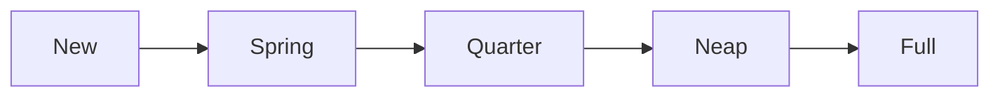

# The booklet format, v0.2

**A booklet is one Markdown file that a person can read and edit in any text editor, that Obsidian shows as a normal note, and that the Booklet renderer, or a Booklet plugin inside Obsidian, turns into activities with questions, widgets and reading.** The prose is the document. Booklet's own elements are single callout lines. Anything that is data, and anything a reader answers, lives in fenced blocks at the end of the file. A new booklet that nobody has answered yet contains no JSON at all.

> **Status: v0.2, draft.** This is a young, evolving format — v0.2 is the one
> version number that matters: this spec, the renderer, the skill, the
> tests, and the `booklet: 0.2` every file's front matter declares, all
> together, all the same number. Nothing here is frozen: the format itself
> may extend compatibly (a reader from before a change still opens a file
> that uses it), but it doesn't promise stability yet. There is no earlier
> format to compare against or convert from — it was retired entirely on
> 2026-09-29, and this spec no longer documents or mentions it.

**Why it looks like this, in short.** A booklet's design used to live as fenced JSON beside its prose — readable, but not really hand-*editable*: nobody sits down and retypes a JSON object correctly by hand. v0.2 rebuilds the design itself as Markdown, using constructs that already exist and already render somewhere real — GitHub's task lists and callouts, Obsidian's callouts and block embeds, CommonMark's footnotes — rather than inventing new syntax to parse. What Booklet needs and no existing convention supplies (a question's type, a module's boundary) is one small vocabulary of callout lines, `> [!kind|id] Title`, so there is exactly one new grammar to learn, not several. The full account of what was surveyed and why each choice was made is [`docs/why-markdown.md`](docs/why-markdown.md).

---

**Contents**
1. [What a booklet is made of](#1-what-a-booklet-is-made-of)
2. [The file: name and front matter](#2-the-file-name-and-front-matter)
3. [Structure: activities and pages, with every heading left free](#3-structure-activities-and-pages-with-every-heading-left-free)
4. [Booklet lines: one grammar for everything](#4-booklet-lines-one-grammar-for-everything)
5. [Questions](#5-questions)
6. [Reading: callouts, hints, citations, images and figures](#6-reading-callouts-hints-citations-images-and-figures)
7. [Widgets and other data](#7-widgets-and-other-data)
8. [Records: what a reader answered](#8-records-what-a-reader-answered)
9. [Languages](#9-languages)
10. [Obsidian and GitHub: what to expect](#10-obsidian-and-github-what-to-expect)
11. [A complete booklet](#11-a-complete-booklet)
12. [Conformance](#12-conformance)
13. [What's not built yet](#13-whats-not-built-yet)

---

## 1. What a booklet is made of

Four things, and nothing else:

- **Front matter**: a few flat keys at the top, the way Obsidian, Hugo and Jekyll write them.
- **Prose**: ordinary Markdown. Headings at every level, paragraphs, lists, emphasis, links, tables, footnotes, `$math$`, and fenced code, all free for writing.
- **Booklet lines**: a callout line, `> [!kind|id] Title`, marks anything Booklet needs to know about: an activity, a question, a widget, a menu.
- **Fences**: data and records in fenced code blocks, by convention at the end of the file. No code in the prose; data below, referenced from above.

The rule that decides every detail below: **a booklet is answerable only in Booklet's renderer or a Booklet plugin, so everywhere else it only has to read well.** Simple and clean to write; breaks nothing in Obsidian; breaks nothing too badly on GitHub.

---

## 2. The file: name and front matter

**Name.** `<slug>.booklet.md`, and for a translation `<slug>.<lang>.booklet.md`, for example `tides.booklet.md` and `tides.es.booklet.md`. Obsidian shows the note as `tides.booklet`, which is fine. A reader decides what a file is from its contents, never its name.

**Front matter.** Flat keys only, because Obsidian's Properties editor treats nested values as second-class and may rewrite the block when a property is edited. A renderer must accept any key order and any quoting.

```yaml
---
booklet: 0.2
id: example/tides
title: How tides work
lang: en
version: "0.1"
copyright: Example Press, 2026
license: CC-BY-4.0
---
```

- `booklet` is the file format generation this file uses (see the status note above). `id` names this booklet across its translations and versions. `lang` is the one language this file is written in (section 9).
- `copyright`, `license` and `source` live in front matter — the file is the unit that travels (section 3), so the front matter travels with it.
- Reserved by Obsidian and therefore never used for anything else: `tags`, `aliases`, `cssclasses`.

---

## 3. Structure: activities and pages, with every heading left free

**Headings never carry structure.** Every heading level is free for prose. Structure comes from lines Booklet adds, never from heading depth.

**A booklet is a collection of modules, and it is natively one file.** A module is the unit that travels whole, and the unit inside which activities may refer to each other: a weekly report that reads the week's entries, or a dashboard that draws itself, only works if the activities it reads are guaranteed to arrive together, and the module is that guarantee. A renderer handed a folder assembles one file from it (below).

**A module is fenced: an opening line and a closing line, both required.**

```markdown
> [!module|week-1] Week 1

> [!activity|w1-words] Words

…

> [!module|week-1 end] End of Week 1
```

- A linter and a renderer refuse a file whose module is opened and not closed, closed and not opened, or whose fences overlap. Modules bleeding into each other is the failure this rule prevents.
- Within a module, an activity may read another's answers and entries by id. Across modules it may not, and a renderer refuses a reference that crosses.
- **Bare activities and modules may share a file.** A bare activity sits outside any module fence, by convention before the first one, and refers to nothing else. A file with no module fence is bare activities only: a worksheet needs no more.
- Module ids stay unique across a person's collection; adding a module whose id is already present replaces it.

**Where data goes: inline, at the end, or in another file.** The blocks a module's activities refer to (widgets, figures, menus, image definitions) may sit inside the module's own fence, in the booklet's data section at the end (opened by a `> [!data] Data` line), or in another file that the manifest names. The one place they may not sit is inside another module's fence. A reference is looked up in the module's own fence, then the data section, then the files the manifest names.

**Answers never travel inside a module.** A module used for months would drag hundreds of lines of JSON with it. Records sit in the records section at the end, opened by `> [!records] App record`, and grouped by module under `> [!records|week-1] Week 1`, so the right JSON is one search away. To take a module and its answers somewhere else, copy two sections.

**One manifest says where everything is.** Right after the front matter, a `manifest` callout lists the booklet's parts in order, each `inline` or a link to the file that holds it:

```markdown
> [!manifest] How tides work
> - module week-1: inline
> - module week-2: [[week-2.booklet]]
> - data body-map: [[shared/widgets.booklet#^body-map]]
> - data: inline
> - records: inline
```

It is required when anything lives in another file, and recommended always, as the table of contents an editor sees first. A linter checks it against the file and reports a part it names that is missing, or a part in the file it doesn't name. It all works as one file; it all works referenced out. A whole-note embed, `![[week-2.booklet]]`, may stand in a manifest line where the module should render inline in Obsidian.

**Paths follow Obsidian's conventions.** `[[week-2.booklet]]` (Obsidian resolves a note by name anywhere in the vault) or an ordinary Markdown link, `[Week 2](modules/week-2.booklet.md)`, relative to the booklet's own folder. A block in another file is `![[week-2.booklet#^body-map]]`. Absolute machine paths such as `~/notes/…` are outside what Obsidian (vault-relative) or a browser (no file system) can read, so they are not supported; an unresolved link is shown as one and breaks nothing.

**Navigating the file in an editor.** Every part opens with a line of one shape, so searching for `[!module|`, `[!activity|`, `[!data` or `[!records` walks the file, and the manifest at the top is its table of contents.

**An activity starts at an activity line and runs to the next one.** A file with no activity line is one activity, named by the front matter title. So a one-page worksheet needs no structure at all.

```markdown
> [!activity|rd-tides] Why the sea rises twice a day

Prose, headings, questions…

> [!activity|rd-check repeat] Check yourself

…
```

The word after the id is the activity's kind:

| kind | what it means |
| --- | --- |
| *(none)* | answered once, edited in place |
| `repeat` | each completion is kept as a dated entry, with a history |
| `repeat daily` | one kept entry per day; completing again replaces today's |

Flag that may follow: `hidden` (kept in the file, not offered).

**Pages are separated by a horizontal rule.** Any thematic break inside an activity (`---`, `***`, `___`) is a page break, the way Marp splits slides. A page's name in the left menu is its first heading, at whatever level; a page with no heading is "Page 2". An activity with no rule is one page.

⚠️ `---` needs a blank line above it, or Markdown turns the line before it into a heading and the page break vanishes. `***` has no such trap. Both are accepted.

**Links between activities** are ordinary heading links, which Obsidian resolves natively: `[[#Check yourself]]` or `[Check yourself](#check-yourself)`. The renderer opens the activity that contains that heading. Reading another activity's *answers* is a module matter, above.

---

## 4. Booklet lines: one grammar for everything

```markdown
> [!kind|id setting:value flag] Title
```

- **`kind`** says what the line is: an activity, a question type, a widget, a menu, or a reading callout. Kinds are Booklet's own vocabulary, and the set is meant to grow (section 5).
- **`id`** is required for anything that stores an answer or is referenced (activities, questions, widgets, menus). Letters, digits and dashes only, so every id is also valid wherever Obsidian wants one. Unique within the file. Reading callouts need none.
- **Settings** follow the id, separated by spaces: `menu:feelings`, `min:0`, `open`, `repeat`.
- **The title** is the words a reader sees: the question, the activity name, the caption.
- **A fold marker** may follow the bracket, as in Obsidian: `> [!hint]- Hint` starts folded.

**What comes after the line.**
- A **list** belongs to the line (a question's options, a menu's entries). It may follow directly or after one blank line; two blank lines end the question. **One exception, from Markdown itself:** only a numbered list that starts at `1.` may interrupt a paragraph, so a list starting at `0.` (or any other number) directly under the line is swallowed into the title. Put the blank line in; the reference linter requires it there and allows it everywhere else.
- **Lines starting with `>`** belong to the callout, for reading callouts that hold prose. A question's prompt is its title; instructions go in the prose above it.
- **A paragraph** after the line needs a blank line first, like any paragraph. Without one, Markdown folds it into the callout (a "lazy continuation").
- A **hint** or **solution** callout right after a question belongs to that question (section 6).

In Obsidian, an unknown kind renders as a note-style callout with the title, so every Booklet line is a visible, titled box there. The `|id` part is callout metadata, which Obsidian parses into `data-callout-metadata` for themes to style; it is not documented in Obsidian's own help, but it renders correctly.

---

## 5. Questions

**Principle: declare the type on the question line; put plain lists under it. Nothing else.**

### Text and lines

```markdown
> [!text|noticed] What surprised you?

> [!text|reflection long] Write freely about the week.

> [!lines|wins] Three things that went well
```

`text` is a text answer; `long` asks for a bigger box. `lines` is repeated one-line entries.

### Choice: pick one, pick any

```markdown
> [!choice|biggest] When do the largest tides come?
- [ ] At the quarter moons
- [x] Near the new and the full moon

> [!multi|felt open] What did you feel? Add your own.
- [ ] Calm
- [ ] Tired
- [ ] Curious
```

- `choice` takes one answer, `multi` any number. `open` lets the reader add options of their own.
- **`[x]` marks a correct option**, for study booklets. A worksheet with no right answer leaves every box `[ ]`. In Obsidian's Reading view, a click on a checkbox rewrites `[ ]` to `[x]` in the file — a real behavior, and the accepted trade-off: a booklet's own reader answers it in Booklet, never by clicking a checkbox in an Obsidian note, so the answer key is never at risk from ordinary use.
- **Options are identified by position, not by id.** The third option is the third option in every language file too, so a whole questionnaire carries one id. This is what removes per-item tags. A file that reorders options after people have answered breaks its own answers.

### Scale, number, date

```markdown
> [!scale|mood] How was today?

0. Awful
1. Rough
2. Fine
3. Good
4. Great

> [!number|sleep min:0 max:24] Hours slept

> [!date|when] When did it happen?
```

A `scale` lists its anchors as a numbered list; **the number is the stored answer**, so a questionnaire scored from 0 starts at `0.`, with a blank line above it (section 4).

### Matrix: items and anchors — not built yet

A matrix question (several items, one shared scale of anchors, such as a symptom questionnaire) is planned but not implemented by the reference renderer: a bulleted list of items, then a numbered list of anchors, deliberately not a table, so one stray space never breaks it. See [what's not built yet](#14-whats-not-built-yet).

### Shared menus

A list used by several questions is written once, anywhere in the file, and named on the question line:

```markdown
> [!menu|feelings]
- Calm
- Tired
- Curious

> [!multi|morning menu:feelings] This morning I felt…

> [!multi|evening menu:feelings] This evening I feel…
```

### Widgets as questions

A widget the reader operates (the body map, the feelings grid) is a `widget` line whose body embeds the widget's data block (section 7). What the engine records is stored under the widget's id.

### The kinds, in one table

| kind | answer stored | under the line |
| --- | --- | --- |
| `text` | a string | nothing (`long` for a big box) |
| `lines` | a list of strings | nothing |
| `choice` | the option's position, from 1 | a task list; `[x]` = correct |
| `multi` | a list of positions, plus the reader's own strings with `open` | a task list |
| `scale` | the anchor's number | a numbered list |
| `number` | a number | nothing; `min:` `max:` `step:` |
| `date` | `YYYY-MM-DD` | nothing |
| `matrix` *(planned)* | one anchor number per item, by position | a bulleted list, then a numbered list |
| `widget` | whatever its engine records | an embed of the data block |

**How the vocabulary grows.** A new question type is a new kind word, a documented shape for what follows the line, and an engine in the renderer. The grammar never changes. A renderer that meets a kind it doesn't know shows the line as a callout and what follows as lists, and says so, instead of failing.

---

## 6. Reading: callouts, hints, citations, images and figures

### Callouts

Reading set apart is an Obsidian callout, with `>` on every line of its body. Use Obsidian's built-in kinds where they fit (`note`, `tip`, `example`, `quote`, `question`, `warning`), and Booklet's three for guided reading: `diff` (where this differs from the reader's own guide), `law` (the rule as it now stands), `opinion` (an author's view, not to be learned as a rule).

```markdown
> [!diff] Your guide says the tide turns every six hours
> The guide rounds it off. High water comes a little later each day.[^atlas-12]

> [!group]- Background, if you want it
> Folded until opened. Anything Markdown can hold goes inside.
```

### Hints and solutions

A `hint` or `solution` callout directly after a question belongs to it. Fold them.

```markdown
> [!choice|biggest] When do the largest tides come?
- [ ] At the quarter moons
- [x] Near the new and the full moon

> [!hint]- Hint
> Think about when the sun and the moon pull in the same direction.
```

### Citations

A citation is an ordinary CommonMark footnote — the mark `[^id]` in the text, and its definition, `[^id]: …`, anywhere in the file. There is no separate sources registry: a source cited at two places is two footnotes.

```markdown
Most harbours see two high tides each lunar day.[^atlas-12]

[^atlas-12]: *The Harbour Tide Atlas*, 2nd edition (2019), p. 12: "The tide rises and falls twice in each lunar day." Verified 2026-09-20.
```

**A footnote's note, read into a citation.** The reference renderer reads a definition's text and, where it fits the pattern `*Title*, details, p. N: "quote" Verified YYYY-MM-DD.`, turns it into a source and a citation — title, edition, page, quote, and verified badge. This gives a reading module a numbered mark, side panel, hover preview and verified badge, with no separate registry to maintain. A note that doesn't fit the pattern becomes the quote alone, with no source; the panel shows this gracefully (a plain "no source" line) rather than failing. The pattern, piece by piece:

| piece | example | required? |
| --- | --- | --- |
| the source's title | `*The Harbour Tide Atlas*` (italic) | for a source to be shown at all |
| its edition or other detail | `2nd edition (2019)` | optional |
| the page or place | `p. 12`, `pp. 12–14`, `art. 14` | optional |
| the quote, in quotation marks | `"The tide rises and falls twice…"` | required for any citation |
| a verified date | `Verified 2026-09-20.` | optional; shows the ✓ badge |

**The definition line itself never shows.** It is stripped from the document's own prose at the point the file is read, so it is never rendered as a stray paragraph — the citation lives only in the numbered mark and its panel.

### Images

Reference style, with the address at the end of the file among the data, so the prose stays clean. GitHub and Obsidian both resolve it and hide the definition line.

```markdown
![The harbour at low water][harbour]

[harbour]: images/harbour.jpg
```

Images are linked, never embedded.

### Figures: diagrams placed by reference

A diagram is written once, in the data section, with an Obsidian block id on the line after its fence, and placed in the prose with Obsidian's own embed:

```markdown
Here is the cycle:

![[#^tide-cycle]]

…


^tide-cycle
```

Obsidian draws the diagram natively at the embed. On GitHub the embed line shows as text and the diagram still renders where the fence itself sits. A mermaid fence written directly in the prose still works everywhere, as it always did.


### Queries: what the reader kept

A `booklet query` block, placed in an activity's prose, shows what the reader has kept elsewhere in the same module. It is read-only and takes no answer.

```booklet query
from: log
fields: situation, ease
newest: 3
empty: Nothing logged yet.
```

- `from:` (required) is an activity id or a question id in the same module. An activity must keep entries (`repeat` or `repeat daily`); the query shows its kept entries, newest first, each with its date and answers. A question shows that question's answers: each kept answer with its date if its activity keeps entries, or its one answer if not.
- `fields:` (optional, with an activity) names the questions to show, comma-separated, in that order. Without it, every question is shown.
- `newest:` (optional) shows only that many of the most recent entries.
- `empty:` (optional) is what shows while nothing is kept. Without it, the renderer shows its own short line.
- It reads kept entries and given answers only, never a draft in progress.
- A query never reads across modules. One whose `from:` names nothing, or something in another module, is refused: the linter reports an error and a renderer draws nothing for it. A file with no module fence is one module for this rule.
- The kind, `query`, is on the fence line; the settings are the block's lines, `key: value`. Ids follow the rule in section 4 (letters, digits and dashes).
- In Obsidian without a Booklet plugin, and on GitHub, the block shows as a short code block.

---

## 7. Widgets and other data

**A widget is data, never code**. Its data is a fenced block named `booklet widget`, with a block id after it, and it is placed and operated through a `widget` line:

````markdown
> [!widget|body] Where do you feel it?
> ![[#^body-map]]

```booklet widget
{ "engine": "svg-regions", "title": "Body map",
  "figures": [ { "id": "front", "svg": "<svg …>", "regions": ["head", "chest"] } ],
  "regions": [ { "id": "chest", "label": "Chest" } ] }
```
^body-map
````

- The fence holds JSON or YAML (YAML reads JSON, so JSON always works). Strings in YAML must be quoted.
- `engine` names what draws it: `svg-regions`, `grid-select`, `card-board`. Labels are plain strings, because the file has one language.
- Settings on the widget line: `readonly` (shown, not operated), `describe` (followed by what each part says about itself).
- **An `svg-regions` figure** marks each region the reader can tap as a shape with `class="rg"` and a `data-r` attribute naming the region id. Every other shape in the figure is drawn as a plain outline, and the renderer styles both; a figure needs no styling of its own.
- **Where it renders:** Booklet draws the widget. A Booklet plugin in Obsidian would draw it through the code-block handler for `booklet` — not yet built (section 13). Obsidian without the plugin shows the data block inside the embed frame, which is long but harmless. GitHub shows the embed line as text and the fence as code.
- Every `svg` string is sanitized before drawing.

**Data blocks live inside their module's fence, or in the data section at the end** (`> [!data] Data`), or in a file the manifest names (section 3). The renderer finds fences by their language word and block id, never by a heading.

---

## 8. Records: what a reader answered

Records are JSON, written by the app, one fence per record, each parsed on its own so that one broken record costs one record. A file nobody has answered has none.

````markdown
> [!records] App record — do not edit below this line

> [!records|rd-tides] How tides work

```booklet answers
{ "noticed": "How much the range changes over a fortnight", "biggest": 2, "mood": 3 }
```

```booklet entries rd-check
{"items": [
{"ts": "2026-09-27T14:02:00Z", "biggest": 2, "noticed": "…"}
]}
```

```booklet draft rd-check
{"noticed": "the printer aga"}
```
````

- `answers` holds once-answered questions, keyed by question id; ids are unique across the file, so no activity prefix is needed. Records sit in the records section at the end, grouped by module under `> [!records|<module>]` lines, never inside a module's fence (section 3).
- `entries <activity>` holds a `repeat` activity's kept entries, each with a `ts`, identified by timestamp. `draft <activity>` holds what is typed and not yet kept.
- A choice is stored as the option's position from 1, a scale as the anchor's number. Words are shown by the renderer from the file's own lists.
- **The whole records section sits inside `%%` … `%%`**, which hides it from Obsidian's Reading view. A block a `![[…]]` embed points to is never put inside `%%`, because an embed cannot reach a block hidden that way — only data no other part of the file references belongs there, and the records section is exactly that.
- `sync` (where the file is kept) is a record too, preserved unchanged by any reader that doesn't understand it.

---

## 9. Languages

**One language per file.** `lang` in the front matter says which. A translation is a sibling file, `tides.es.booklet.md`, with the same `id`, the same activity and question ids, and the same number of options in every list, in the same order. Answers therefore carry across languages unchanged: position 2 is position 2.

A regional variant (`es-AR`) is its own sibling file, no longer a layer of strings. The renderer's own interface still chains `es-AR` → `es` → `en` for its buttons and dialogs.

A linter, given the siblings, checks that ids match and lists have equal length.

---

## 10. Obsidian and GitHub: what to expect

**Obsidian: nothing here should cause a problem.** The things that would, and how they are avoided:
- `#word` anywhere becomes a tag, so no `#` appears in Booklet syntax outside headings.
- `[[…]]` is a link Obsidian may rewrite on rename. The only double brackets used are Obsidian's own embeds, `![[#^id]]`, which is what they are for.
- `%%` hides text in Reading view and `==text==` highlights. Neither is used, except the record wrapper.
- Block ids allow letters, digits and dashes only; every Booklet id follows that rule.
- The Properties editor may rewrite front matter; the front matter is flat and readers accept any form of it.
- **A checkbox click in Reading view edits the file.** See "Choice" in section 5 for the accepted trade-off.
- `---` on the first line opens front matter, which is intended; `---` directly under text makes a heading, so page breaks need a blank line above or use `***`.

**Obsidian: how it looks without a plugin.** Every Booklet line is a titled callout; questions are callouts followed by lists; figures render at their embed; widgets show their data; a query shows as a code block. **With a Booklet plugin** (not built yet, section 13): the plugin would open the note in a Booklet view (Obsidian's `TextFileView`, the way the Kanban plugin shows a normal note as a board) and draw everything as the web renderer does.

**GitHub.** Callout lines show as quotations with the `[!kind|id]` text visible; lists, task lists, footnotes, math and mermaid render; `![[#^id]]` shows as text. Nothing breaks.

---

## 11. A complete booklet

````markdown
---
booklet: 0.2
id: example/tides
title: How tides work
lang: en
version: "0.1"
---

# How tides work

A short reading, then a check.

> [!activity|rd-tides] Why the sea rises twice a day

Most harbours on this coast see two high tides and two low tides each lunar day.[^atlas-12]
The range is the difference between them: $R = h_{high} - h_{low}$.

![[#^tide-cycle]]

> [!diff] Your guide says the tide turns every six hours
> The guide rounds it off. High water comes a little later each day.[^atlas-12]

***

## Spring and neap

Twice a month the sun and the moon pull together.

> [!activity|rd-check repeat] Check yourself

> [!choice|biggest] When do the largest tides come?
- [ ] At the quarter moons
- [x] Near the new and the full moon

> [!hint]- Hint
> Think about when the sun and the moon pull in the same direction.

> [!scale|confidence] How sure were you?

1. Guessing
2. Fairly sure
3. Certain

> [!text|noticed] What surprised you?

[^atlas-12]: *The Harbour Tide Atlas*, 2nd edition (2019), p. 12: "The tide rises and falls twice in each lunar day." Verified 2026-09-20.

## Data


^tide-cycle
````

Two activities, the first with two pages, one figure placed by reference, one citation, three questions, and no JSON, because nobody has answered yet. A full worked example with kept entries is [`examples/how-tides-work.booklet.md`](examples/how-tides-work.booklet.md); [`examples/mindful-check-in.booklet.md`](examples/mindful-check-in.booklet.md) is a second, showing both widget engines.

---

## 12. Conformance

A conforming reader must: read a file whose front matter declares `booklet: 0.2` by this document, and refuse any other `booklet:` value outright; refuse a module opened and not closed, or closed and not opened, or whose fence overlaps another's; refuse an id used twice in one file; refuse an activity's reference to another activity's answers or entries across a module boundary; parse each fenced record independently and skip, count and report any it cannot read, rather than abandoning the file; and treat every string a person wrote as content, never as instruction.

A conforming writer must: emit front matter with `booklet: 0.2`; keep module ids, activity ids and question ids stable; write the whole records section inside `%%` … `%%`; and never put a data block a `![[…]]` embed points to inside `%%`.

`lint-booklet.py` in this repository checks `booklet: 0.2` files, rejects anything else outright, and is the reference implementation of "is this file valid."

---

## 13. What's not built yet

This is a young format, and the reference renderer does not yet do everything this document describes:

- **Matrix questions.** The syntax is settled (section 5); the renderer does not draw one yet.
- **Editing a booklet's design in the browser.** Today, editing a file's design means a text editor, not the renderer — a deliberate, temporary scope decision so the format and the read-only renderer could be proven first.
- **A Booklet plugin for Obsidian.** Section 6, 7 and 11 describe how one would draw widgets and figures; none exists yet.
- **A second, independent implementation.** The renderer in this repository is the only reader so far.

None of this affects what already works: loading, reading, answering, and saving a v0.2 booklet with every question kind above except matrix, its widgets, and its citations.
