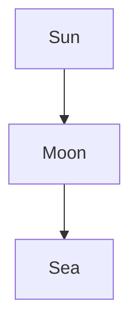
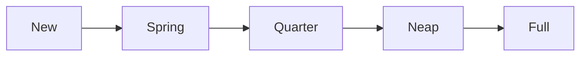

> [!manifest] Figures and math
> - module figs: inline
> - data: inline

> [!module|figs] Figures and math

> [!activity|rd-figs] Diagrams and formulas

The cycle, placed by reference:

![[#^tide-cycle]]

A diagram written straight in the prose:



A broken one, placed by reference:

![[#^broken-one]]

A fence that is not a diagram, placed by reference:

![[#^snippet]]

Inline math $a^2 + b^2 = c^2$ and display math:

$$
\int_0^1 x^2 \, dx = \tfrac{1}{3}
$$

A formula Temml cannot read: $\badmacro{x}$.

Prices stay prices: it costs $5 and $10 today, and a literal \$ sign stays.

> [!module|figs end]

> [!data] Data


^tide-cycle

```mermaid
graph LR; A -->
```
^broken-one

```python
print("hello")
```
^snippet
